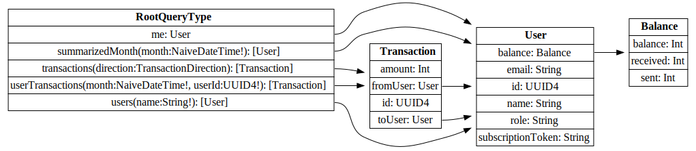

<div id="top"></div>
<!--
*** Thanks for checking out the Best-README-Template. If you have a suggestion
*** that would make this better, please fork the repo and create a pull request
*** or simply open an issue with the tag "enhancement".
*** Don't forget to give the project a star!
*** Thanks again! Now go create something AMAZING! :D
-->


<!-- PROJECT SHIELDS -->
<!--
*** I'm using markdown "reference style" links for readability.
*** Reference links are enclosed in brackets [ ] instead of parentheses ( ).
*** See the bottom of this document for the declaration of the reference variables
*** for contributors-url, forks-url, etc. This is an optional, concise syntax you may use.
*** https://www.markdownguide.org/basic-syntax/#reference-style-links
-->
[![Contributors][contributors-shield]][contributors-url]
[![Stargazers][stars-shield]][stars-url]
[![Issues][issues-shield]][issues-url]
[![MIT License][license-shield]][license-url]
[![coverage][coveralls-shield]][coveralls-url]
[![LinkedIn][linkedin-shield]][linkedin-url]


<!-- PROJECT LOGO -->
<br />
<div align="center">
  <h3 align="center">Employee Reward App</h3>

  <p align="center">
    An awesome way to manage employee rewards
    <br />
    <br />
    <a href="https://secret-dawn-99555.herokuapp.com/">View Demo</a>
    ·
    <a href="https://github.com/othneildrew/Best-README-Template/issues">Report Bug</a>
    ·
    <a href="https://github.com/othneildrew/Best-README-Template/issues">Request Feature</a>
  </p>
</div>


<!-- TABLE OF CONTENTS -->
<details>
  <summary>Table of Contents</summary>
  <ol>
    <li>
      <a href="#about-the-project">About The Project</a>
      <ul>
        <li><a href="#built-with">Built With</a></li>
      </ul>
    </li>
    <li>
      <a href="#getting-started">Getting Started</a>
      <ul>
        <li><a href="#prerequisites">Prerequisites</a></li>
        <li><a href="#installation">Installation</a></li>
      </ul>
    </li>
    <li><a href="#usage">Usage</a></li>
    <li><a href="#license">License</a></li>
    <li><a href="#contact">Contact</a></li>
    <li><a href="#acknowledgments">Acknowledgments</a></li>
  </ol>
</details>


<!-- ABOUT THE PROJECT -->
## About The Project

[![Employee Reward App Screen Shot][product-screenshot]](https://github.com/ravensiris/employee-reward-app)

Solution for managing rewards in your company.

<p align="right">(<a href="#top">back to top</a>)</p>

### Built With

* [Phoenix](https://phoenixframework.org/)
* [Absinthe](https://github.com/absinthe-graphql/absinthe)
* [React](https://reactjs.org/)
* [Apollo](https://www.apollographql.com/docs/react/)
* [Bulma](https://bulma.io/)

<p align="right">(<a href="#top">back to top</a>)</p>


<!-- GETTING STARTED -->
## Getting Started

This is an example of how you may give instructions on setting up your project locally.
To get a local copy up and running follow these simple example steps.

### Prerequisites

* [pnpm](https://pnpm.io/) (or your favorite node package manager)
* [Docker](https://www.docker.com/)
* [docker-compose](https://docs.docker.com/compose/install/)
* [Elixir >=1.13(Erlang/OTP 24)](https://elixir-lang.org/)
* [git](https://git-scm.com/)

### Installation

1. Clone the repo
   ```sh
   git clone https://github.com/ravensiris/employee-reward-app
   cd employee-reward-app
   ```
2. Get your Github API keys
  https://docs.github.com/en/developers/apps/building-oauth-apps/creating-an-oauth-app

2. Create `config/dev.secret.exs`
  ```
  # config/dev.secret.exs
  import Config

  config :employee_reward_app, :pow_assent,
    providers: [
      github: [
        client_id: YOUR_CLIENT_ID,
        client_secret: YOUR_CLIENT_SECRET,
        strategy: Assent.Strategy.Github
      ]
    ]
  ```

3. Install mix deps
   ```sh
   mix deps.get
   mix deps.compile
   ```

4. Install node deps
  ```sh
  cd assets
  pnpm i
  cd ..
  ```

5. Run Postgres & Redis

  * Postgres should be on port 5432
  * Redis should be on port 6379
  
  ```sh
  docker-compose up -d
  ```

7. Run migrations
  ```sh
  mix ecto.migrate
  ```

8. Run the app

  ```sh
  mix phx.server
  ```

<p align="right">(<a href="#top">back to top</a>)</p>

<!-- USAGE EXAMPLES -->
## Usage

Your app should be on http://localhost:4000/
You can register using the dev mailbox at http://localhost:4000/dev/mailbox

_For more examples, please refer to the [Documentation aka source](https://github.com/ravensiris/employee-reward-app)_

<p align="right">(<a href="#top">back to top</a>)</p>

## License

Distributed under the GPLv3 License. See `COPYING` for more information.

<p align="right">(<a href="#top">back to top</a>)</p>

<!-- CONTACT -->
## Contact

Maksymilian Jodłowski - [@ravensiris_](https://twitter.com/ravensiris_) - maksymilian.jodlowski@gmail.com

Project Link: [https://github.com/ravensiris/employee-reward-app](https://github.com/ravensiris/employee-reward-app)

<p align="right">(<a href="#top">back to top</a>)</p>


<!-- ACKNOWLEDGMENTS -->
## Acknowledgments

* [Pow](https://powauth.com/)
* [Ecto](https://github.com/elixir-ecto/ecto)
* [ex_machina](https://github.com/thoughtbot/ex_machina)
* [excoveralls](https://github.com/parroty/excoveralls)

<p align="right">(<a href="#top">back to top</a>)</p>

## Technical details

### How transactions work

Each transaction has a `from_user`, `to_user` and `inserted_at`

https://dbdiagram.io/embed/624ca386d043196e39004e60

```dbml
Table transaction as T{
  id uuid [pk]
  from_user uuid
  to_user uuid
  amount int
  inserted_at datetime
}
```

#### Calculating the balance for a given month

``` elixir
start_month = Timex.beginning_of_month(month)
end_month = Timex.end_of_month(start_month)

filter_date_transaction =
  from(t in Transaction,
    where: fragment("? BETWEEN ? AND ?", t.inserted_at, ^start_month, ^end_month)
  )
  |> subquery()

sent =
  from(t in filter_date_transaction,
    select: %{user_id: t.from_user_id, sent: sum(t.amount)},
    group_by: t.from_user_id
  )

received =
  from(t in filter_date_transaction,
    select: %{user_id: t.to_user_id, received: sum(t.amount)},
    group_by: t.to_user_id
  )

summarized =
  from(u in User,
    left_join: s in subquery(sent),
    on: u.id == s.user_id,
    left_join: r in subquery(received),
    on: u.id == r.user_id,
    select_merge: %{
      balance: %{
        sent: coalesce(s.sent, 0),
        received: coalesce(r.received, 0),
        balance: 50 - coalesce(s.sent, 0) + coalesce(r.received, 0)
      }
    }
  )
  |> Repo.all()
```

#### Usage of a view

For current month's balance a view is used.

Here is some SQL(Postgres)

``` sql
CREATE VIEW transactions_balance AS
WITH CURRENT_ACTIVE_TRANSACTIONS AS
  (SELECT TO_USER_ID,
      FROM_USER_ID,
      AMOUNT
    FROM TRANSACTIONS
    WHERE
  EXTRACT(YEAR FROM INSERTED_AT) = EXTRACT(YEAR FROM NOW())
  AND
  EXTRACT(MONTH FROM INSERTED_AT) = EXTRACT(MONTH FROM NOW())
  ),			RECEIVED AS
  (SELECT TO_USER_ID AS USER_ID,
      SUM(AMOUNT) AS RECEIVED
    FROM CURRENT_ACTIVE_TRANSACTIONS
    GROUP BY TO_USER_ID),
  SENT AS
  (SELECT FROM_USER_ID AS USER_ID,
      SUM(AMOUNT) AS SENT
    FROM CURRENT_ACTIVE_TRANSACTIONS
    GROUP BY FROM_USER_ID),
  PRE_BALANCE AS
  (SELECT COALESCE(R.USER_ID, S.USER_ID) USER_ID,
      COALESCE(RECEIVED,
        0) RECEIVED,
      COALESCE(SENT,
        0) SENT
    FROM RECEIVED R
    FULL OUTER JOIN SENT S ON R.USER_ID = S.USER_ID)
SELECT coalesce(USER_ID, u.id) user_id,
  coalesce(RECEIVED, 0) RECEIVED,
  coalesce(SENT, 0) SENT,
  50 - coalesce(SENT, 0) + coalesce(RECEIVED,0) AS BALANCE
FROM PRE_BALANCE pb full outer join users u on u.id = pb.user_id;
```

#### Why?

It allows to store an entire history of transactions with minimal amount of rows for a performance
penalty coming from having to run over each row from a given month to calculate the balance.

One way of optimizing would be making the query specific to a user(indexed) thus reducing the
amount of rows to go through.

Material view was tested but resulted in a race condition where a user could go into debt if
the materialized view didn't refresh fast enough.

All in all this approach is fine as there was no requirement on amount of users or transactions per month.

### How does the GraphQL schema look like



``` graphql
"Represents a schema"
schema {
  query: RootQueryType
  mutation: RootMutationType
  subscription: RootSubscriptionType
}

"Transaction direction relative to the user"
enum TransactionDirection {
  "Incoming transactions"
  INCOMING

  "Outgoing transactions"
  OUTGOING
}

type Balance {
  balance: Int
  received: Int
  sent: Int
}

"""
The `UUID4` scalar type represents UUID4 compliant string data, represented as UTF-8
character sequences. The UUID4 type is most often used to represent unique
human-readable ID strings.
"""
scalar UUID4

type RootSubscriptionType {
  "Announces new transactions"
  newTransaction(direction: TransactionDirection!): Transaction

  "Announces changes in balance"
  updateBalance: Balance
}

type RootMutationType {
  "Send credits to another user"
  transaction(amount: Int!, to: UUID4!): Transaction

  "ADMIN ONLY: Delete given transaction"
  deleteTransaction(transactionId: UUID4!): Transaction
}

type RootQueryType {
  "Get current user"
  me: User

  "Lists 10 recent transactions"
  transactions(direction: TransactionDirection): [Transaction]

  "Find user by name with fuzzy search"
  users(name: String!): [User]

  "ADMIN ONLY: get summary of a month"
  summarizedMonth(month: NaiveDateTime!): [User]

  "ADMIN ONLY: get user's transactions for a month"
  userTransactions(month: NaiveDateTime!, userId: UUID4!): [Transaction]
}

"""
The `Naive DateTime` scalar type represents a naive date and time without
timezone. The DateTime appears in a JSON response as an ISO8601 formatted
string.
"""
scalar NaiveDateTime

type Transaction {
  id: UUID4
  fromUser: User
  toUser: User
  amount: Int
}

type User {
  id: UUID4
  email: String
  name: String
  role: String
  balance: Balance
  subscriptionToken: String
}
```


<!-- MARKDOWN LINKS & IMAGES -->
<!-- https://www.markdownguide.org/basic-syntax/#reference-style-links -->
[contributors-shield]: https://img.shields.io/github/contributors/ravensiris/employee-reward-app.svg
[contributors-url]: https://github.com/ravensiris/employee-reward-app/graphs/contributors
[stars-shield]: https://img.shields.io/github/stars/ravensiris/employee-reward-app.svg
[stars-url]: https://github.com/ravensiris/employee-reward-app/stargazers
[issues-shield]: https://img.shields.io/github/issues/ravensiris/employee-reward-app.svg
[issues-url]: https://github.com/ravensiris/employee-reward-app/issues
[license-shield]: https://img.shields.io/github/license/ravensiris/employee-reward-app.svg
[license-url]: https://github.com/othneildrew/Best-README-Template/blob/master/LICENSE.txt
[linkedin-shield]: https://img.shields.io/badge/-LinkedIn-black.svg?logo=linkedin&colorB=555
[linkedin-url]: https://linkedin.com/in/ravensiris
[coveralls-shield]: https://img.shields.io/coveralls/github/ravensiris/employee-reward-app
[coveralls-url]: https://coveralls.io/github/ravensiris/employee-reward-app
[product-screenshot]: images/screenshot.png


### Cool features
#### GraphQL subscribtions & websockets
User's have their balance and sent history updated real time through websockets
